  

# Cześć! 👋

Miłośnik Charmandera ❤️ i koloru czerwonego. Programuję głównie w Pythonie, tworząc i rozwijając własne projekty. W wolnym czasie gram w gry 🎮 i obserwuję ptaki 🐦.

## 🛠️ Technologie

## 📊 Statystyki języków

<a href="https://wakatime.com/@96deb40c-032f-41cf-91a2-6721828436fe">
  

  

  

    
    
  

  
  

    
  

</a>
